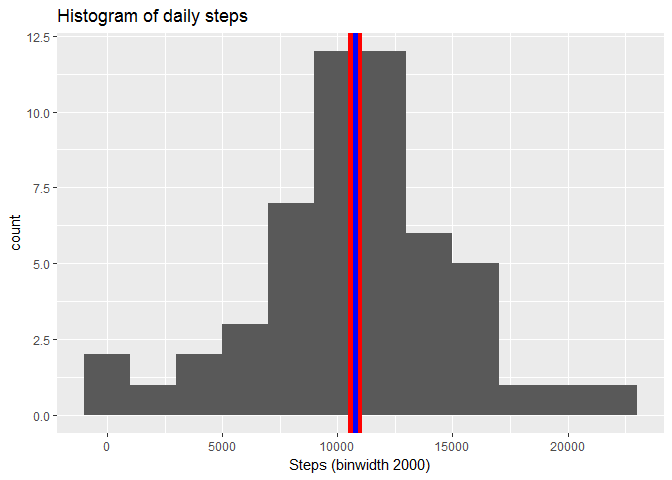
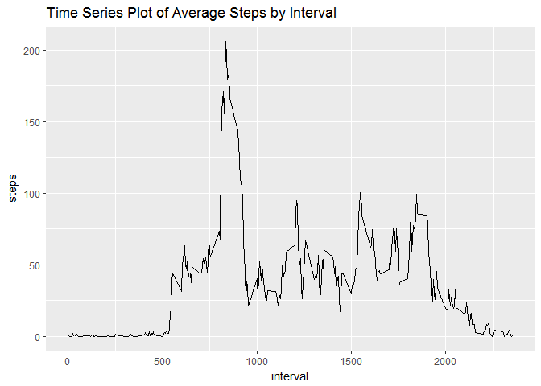
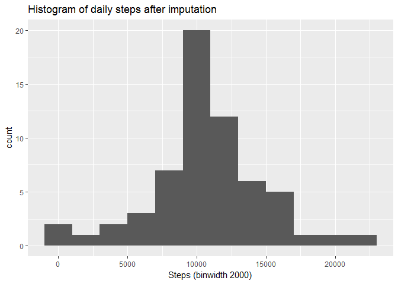
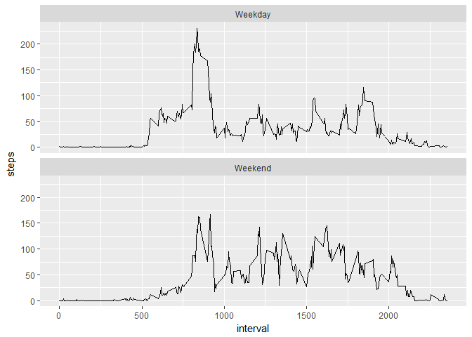

Loading Data
------------

Our first job here is to load data

    setwd("C:/Users/ppeddi001c/Desktop/DataScience/R/activity")
    activity<-read.csv('activity.csv')
    head(activity)

    ##   steps       date interval
    ## 1    NA 2012-10-01        0
    ## 2    NA 2012-10-01        5
    ## 3    NA 2012-10-01       10
    ## 4    NA 2012-10-01       15
    ## 5    NA 2012-10-01       20
    ## 6    NA 2012-10-01       25

preprocessing the data
----------------------

    library(dplyr)
    totalSteps <- aggregate(steps ~ date, data = activity, sum, na.rm = TRUE)

What is mean total number of steps taken per day?
-------------------------------------------------

     #caluclate mean and median
            mean_value = round(mean(totalSteps$steps,na.rm = TRUE), 1)
            median_value = round(median(totalSteps$steps,na.rm = TRUE), 1)

    library(ggplot2)
    a <- ggplot(totalSteps,show_guide=T,aes(x = steps))+ggtitle("Histogram of daily steps") +
                xlab("Steps (binwidth 2000)") +
                geom_histogram(binwidth = 2000)
    b<-a+geom_vline(xintercept = median_value,lwd = 5, col = 'red')+geom_vline(xintercept = mean_value,lwd = 2, col = 'blue')

    b

here i have tried to achieve having an legend with those mean and median
variable values in ggplot but couldnt succeed however in a base hist
plot i could. if u have any ideas please reply me below.

<https://www.coursera.org/learn/reproducible-research/peer/gYyPt/course-project-1/discussions>

    #So instead i will manually call mean and median values

    mean(totalSteps$steps,na.rm = TRUE)

    ## [1] 10766.19

    median(totalSteps$steps,na.rm = TRUE)

    ## [1] 10765

What is the average daily activity pattern?
-------------------------------------------

    #time series plot of the 5-minute interval 

    stepsInterval <- aggregate(steps ~ interval, data = activity, FUN = mean, na.rm = TRUE)

    names(stepsInterval) <- c("interval","steps")

    stepline <- ggplot(stepsInterval,aes(interval,steps)) +
                     ggtitle("Time Series Plot of Average Steps by Interval") +
                     geom_line()
    stepline  

    #The 5-min time interval contains the maximum number of steps?
    stepsInterval[which.max(stepsInterval$steps),c("interval")]

    ## [1] 835

Imputing missing values
-----------------------

    #sub1 
    #to Calculate total number of missing values in the dataset 

    # total records
    nrow(activity)

    ## [1] 17568

    # missing records
    sum(is.na(activity$steps))

    ## [1] 2304

    #sub2
    #Replacing Missing Values 

    library(plyr)
    imputemean <- function(activity) replace(activity, is.na(activity), mean(activity, na.rm = TRUE))

    # Sub3
    # Creating a New Dataset
    activityimpute <- ddply(activity, ~interval, transform, steps = imputemean(steps))

    #sub4
    #Histogram, Mean and Median

    stepsdate <- aggregate(x = activityimpute$steps , by = list(activityimpute$date), FUN = sum ,na.rm=TRUE)

    names(stepsdate) <- c("date","steps")

    histplot <- ggplot(stepsdate,aes(x = steps)) +
                ggtitle("Histogram of daily steps after imputation") +
                xlab("Steps (binwidth 2000)") +
                geom_histogram(binwidth = 2000)
    histplot 

    #New Mean and median for values with out nulls

    mean(stepsdate$steps,na.rm = TRUE)

    ## [1] 10766.19

    median(stepsdate$steps,na.rm = TRUE)

    ## [1] 10766.19

I do see the median has been increased little bit but mean remained the
same.

Are there differences in activity patterns between weekdays and weekends?
-------------------------------------------------------------------------

    #sub1
    #New Factor Variable

    activityimpute$dateP <- as.POSIXlt(activityimpute$date,format="%Y-%m-%d")
    activityimpute$day <- "Weekday"
    activityimpute$day [weekdays(activityimpute$dateP) %in% c("Saturday","Sunday")] <- "Weekend"

    #sub2
    #Weekday/Weekend Comparison
    finalactivityimpute <- aggregate(activityimpute[1],by=activityimpute[c(3,5)],FUN=mean,na.rm=TRUE)

    library(ggplot2)
    plot <- ggplot(data = finalactivityimpute,aes(x=interval,y=steps))
    plot + geom_line() + facet_wrap(~day,nrow=2)

Here i did have some issue using "keep\_md: true" statement Error in
yaml::yaml.load(enc2utf8(string), ...) : Scanner error: mapping values
are not allowed in this context at line 4, column 23 Calls: <Anonymous>
... yaml\_load\_utf8 -&gt; mark\_utf8 -&gt; <Anonymous> -&gt; .Call
Execution halted

So instead i have used the render func to get the .md file.

library(rmarkdown) render("PA1\_template.Rmd", md\_document())

EOD
---
